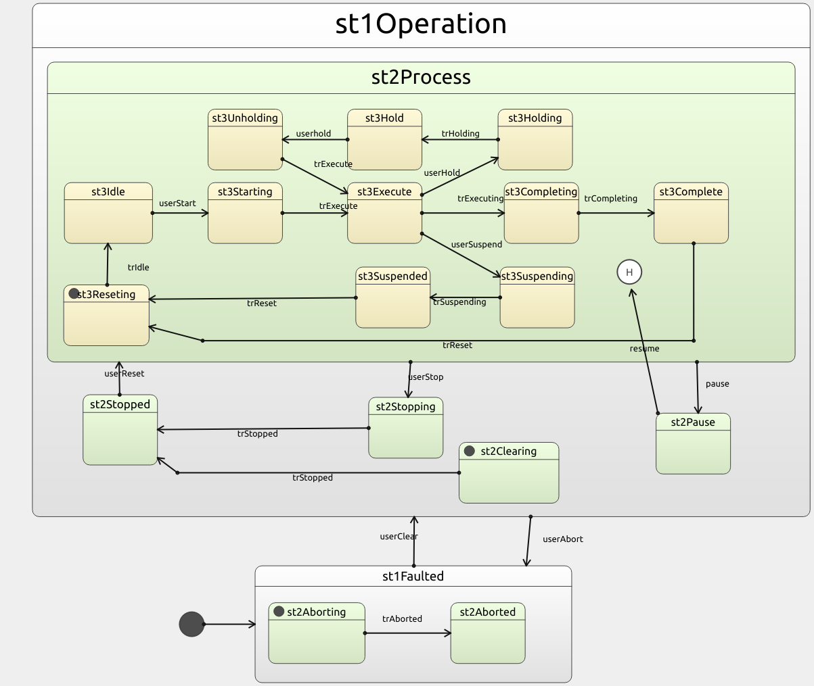

# ros_scxml
[](https://travis-ci.com/swri-robotics/ros_scxml)
[](http://github.com/swri-robotics/ros_scxml/issues)

[](https://opensource.org/licenses/BSD-2-Clause)

Lightweight finite state machine library that uses the [SCXML](https://commons.apache.org/proper/commons-scxml/guide/scxml-documents.html) standard

---
## Prerequisites
### QT 5
The QScxml library is only available from version Qt 5.7 and higher. This implementation currently uses Qt 5.12.2 or above.
  
#### Recommended Download (PPA)
- [This PPA](https://launchpad.net/~beineri) provides binary distributions of various versions of Qt for various operating systems
    - On the PPA site, select the QT (5.12 or above) version for your system
        - Qt 5.13.x is recommended for Ubuntu 18.04
- Add the PPA
    ```bash
    sudo add-apt-repository ppa:beineri/opt-qt-5.13.2-bionic
    sudo apt-get update
    ```
    > Note: Edit command above to match the version of qt that you'd like to install
- Install the full Qt library 
    ```
    sudo apt install qt513-meta-full
    ```
    > Note: Edit command above to match the version of qt that you'd like to install

#### Alternative Download (Qt Installer)
- The library can be downloaded from [here](http://download.qt.io/official_releases/qt/).  Run the installation script with root access and follow the on screen instructions.
  
#### Setup environment variables
In order to make this library accessible to cmake the `CMAKE_MODULE_PATH` and `LD_LIBRARY_PATH` environment variables must be set.  Locate your Qt installation directory (usually in the */opt* directory) and set the environment variables as follows:

```bash
export PATH=<path>/<to>/<qt>/lib/cmake:$PATH
export LD_LIBRARY_PATH=<path>/<to>/<qt>/lib:$LD_LIBRARY_PATH
export LD_LIBRARY_PATH=<path>/<to>/<qt>/plugins:$LD_LIBRARY_PATH  
```

For the version installed above qt513 it would be as follows:
```bash
export PATH="/opt/qt513/lib/cmake:$PATH"
export LD_LIBRARY_PATH=/opt/qt513/lib:$LD_LIBRARY_PATH
export LD_LIBRARY_PATH=/opt/qt513/plugins:$LD_LIBRARY_PATH
```

---
## Demo program
### Description
- Demo State Machine Workflow (Produced from the scxml file with QT Creator)
  

- Implementation:
  The `demo_scxml_state_machine` ROS node shows how to use the State Machine library with ROS and process specific code.  A key part of this code is in the section that adds custom functions which get invoked when specific states are entered or exited; inspect this section in order to understand how this is accomplished:

  ```cpp
    // adding application methods to SM
    MockApplication process_app(nh);
    bool success = false;
    std::vector<std::function<bool()> > functions = {

      // custom function invoked when the "st3Reseting" state is entered
      [&]() -> bool {
        return sm->addEntryCallback(
            "st3Reseting",
            [&](const Action& action) -> Response {
              // checking passed user data first
              if (!action.data.empty())
              {
                try
                {
                  double secs = boost::any_cast<double>(action.data);
                  ROS_INFO("State received time value of %f seconds", secs);
                }
                catch (boost::bad_any_cast& e)
                {
                  ROS_WARN_STREAM(e.what());
                }
              }

              process_app.resetProcess();
              ros::Duration(3.0).sleep();
              // queuing action, should exit the state
              sm->postAction(Action{ .id = "trIdle" });
              return true;
            },
            false);  // false = runs sequentially, use for non-blocking functions
      },

      // custom function invoked when the "st3Execute" state is entered
      [&]() -> bool {
        return sm->addEntryCallback(
            "st3Execute",
            [&process_app](const Action& action) -> Response { return process_app.executeProcess(); },
            true);  // true = runs asynchronously, use for blocking functions
      },

      // custom function invoked when the "st3Execute" state is exited
      [&]() -> bool {
        return sm->addExitCallback("st3Execute", [&process_app]() {
          process_app.pauseProcess();
          ROS_INFO_STREAM("Process counter at " << process_app.getCounter());
        });
      },

      // custom function invoked prior to entering the "st3Completing" state
      [&]() -> bool {
        return sm->addPreconditionCallback("st3Completing", [&process_app](const Action& action) -> Response {
          Response res;
          static const int REQ_VAL = 16;
          if (process_app.getCounter() >= REQ_VAL)
          {
            return true;
          }
          res.msg = boost::str(boost::format("Counter less than %i") % REQ_VAL);
          res.success = false;

          return res;
        });
      },

      // custom function invoked when the "st3Suspending" state is entered
      [&]() -> bool {
        return sm->addEntryCallback(
            "st3Suspending",
            [&](const Action& action) -> Response {
              ROS_INFO("Suspending process");
              process_app.haltProcess();
              ros::Duration(3.0).sleep();

              // queuing action, should exit the state
              sm->postAction(Action{ .id = "trSuspending" });
              Response res;
              res.success = true;
              return std::move(res);
            },
            true);  // true = runs asynchronously, use for blocking functions
      },

      // custom function invoked when the "st3Completing" state is entered
      [&]() -> bool {
        return sm->addEntryCallback(
            "st3Completing",
            [&process_app](const Action& action) -> Response {
              Response res;
              res.success = true;
              res.data = ros::Time::now().toSec();
              return std::move(res);
            },
            false);  // true = runs asynchronously, use for blocking functions
      },

      // custom function invoked when the "st2Clearing" state is entered, it will exit after waiting for 3 seconds
      [&]() -> bool {
        return sm->addEntryCallback(
            "st2Clearing",
            [&](const Action& action) -> Response {
              ROS_INFO("Clearing to enable process, please wait ...");
              ros::Duration(3.0).sleep();

              // queuing action, should exit the state
              sm->postAction(Action{ .id = "trStopped" });
              return true;
            },
            true);  // true = runs asynchronously, use for blocking functions
      },

      // custom function invoked when the "st2Clearing" state is exited
      [&]() -> bool {
        return sm->addExitCallback("st2Clearing",
                                   [&process_app]() { ROS_INFO("Done Clearing, Process is now good to go ..."); });
      },
    };

  ```

---
### Workspace Setup
#### catkin (ROS1)

1. Build the workspace
    ```
    catkin build
    ```

#### colcon (ROS2)
1. Build colcon environment
    ```
    colcon build --symlink-install
    ```
---
### RUN Demo
#### ROS 1
1. Start the roscore
2. Go to the resource directory:
    ```
    roscd roscpp_scxml_demos/resource/
    ```
3. Open the **demo_packml_sm.scxml** file with QTCreator to display a graphical depiction of the SM workflow.
4. Run the node with the demo scxml file:
    ```
   rosrun roscpp_scxml_demos demo_scxml_state_machine _state_machine_file:=demo_sm.scxml
    ```
5. Echo the current state:
    ```
    rostopic echo /current_state
    ```
6. Call the service to print the available actions at the current state:
    ```
    rosservice call /print_actions "{}"
    ```

    The SM terminal should display something as follows:
    ```
    SM Actions:
      -userClear
      -trAborted
    ```
    This means that the actions available at the current state are **trAborted** and **userClear**
7. Publish an action from the list to the state machine, for instance the **userClear** action will be requested as follows:
    ```
    rostopic pub -1 /execute_action std_msgs/String "data: 'userClear'"
    ```

    This should cause the state machine to go into the **st2Clearing** state.  A few seconds after that it should go into the **st2Stopped** state as the custom entry callback function automatically posts an action.

8. Repeat steps 6 and 7 to experiment with other states and actions, use the SM graph shown in QTCreator to verify the workflow.
9. Additionally, the SM will publish a message to the **/process_msg** topic only when it's in the **st3Execute** state.  When the SM is in that state echo the topic as follows:
    ```
    rostopic echo /process_msg
    ```

#### ROS 2

1. From the *rclcpp_scxml_demos* directory run the demo node as follows
    ```
    ros2 run rclcpp_scxml_demos demo_scxml_state_machine __params:=resource/params.yaml
    ```
2. From another terminal echo the current state
    ```
    ros2 topic echo /current_state
    ```
  You should get the name of the current state printed in the terminal

3. Print current actions
    ```
    ros2 service call /print_actions std_srvs/srv/Trigger
    ```
  In the node terminal you should see a list of available actions within the current state

4. Execute action
    ```
    ros2 topic pub -1 /execute_action std_msgs/msg/String '{data: trAborted}'
    ```
  If the action is valid you should see the following confirmation message in the node terminal
  *"Action trAborted successfully executed"*
